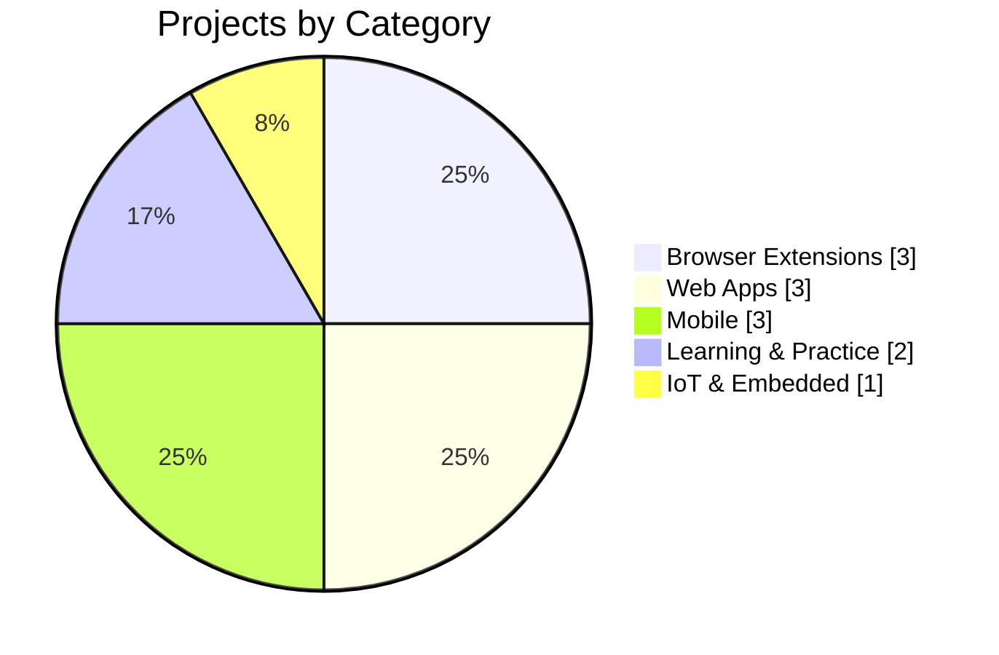
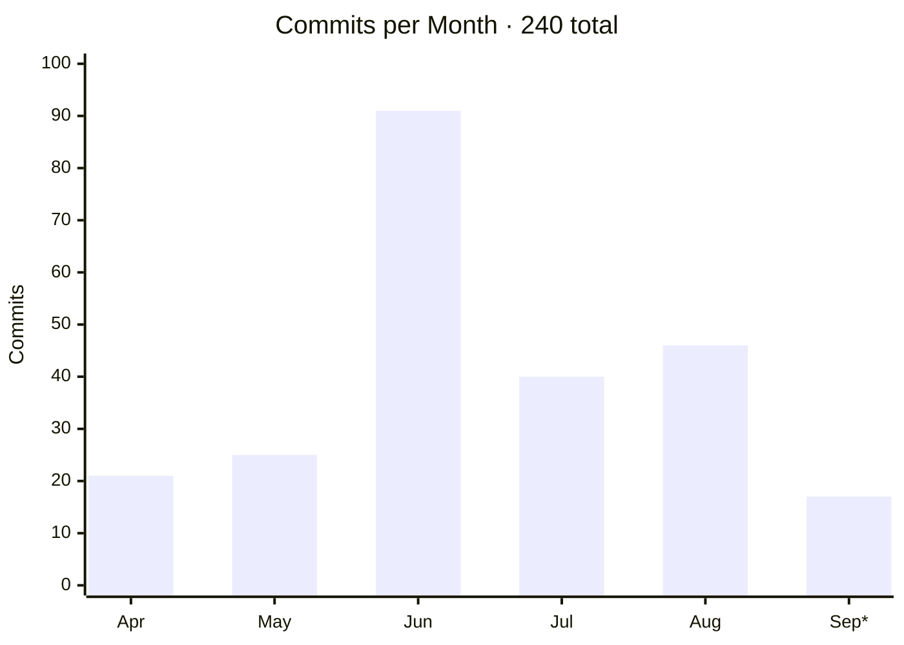

🔭 Currently exploring AI/ML fundamentals with PyTorch &nbsp;·&nbsp; 💬 Ask me about Chrome extension APIs, Android/Kotlin, or client-side document processing

 

## 📈 At a Glance

| 🧩 Extensions | 📱 Mobile | 🌐 Web Apps | 🔌 IoT / Embedded | 📚 Learning |
|:---:|:---:|:---:|:---:|:---:|
| **3** | **3** | **3** | **1** | **2** |

* September is partial, through the 22nd.

 

## 🚀 Featured Projects

### 🧩 Browser Extensions

| Project | Description | Tech |
|---|---|---|
| **[🛡️ Ads Refiner](https://github.com/Prateek-Kumar-Anand/Ads-refiner-extension)** | Privacy-first Manifest V3 blocker — ads, trackers, phishing-link warnings, risky-download protection, and a local analytics dashboard | `JavaScript` `declarativeNetRequest` |
| **[📸 SPider](https://github.com/Prateek-Kumar-Anand/SPider-web-extension)** | One-click tab screenshots with automatic metadata, a searchable capture history, and a folder browser | `JavaScript` |
| **[📊 DataGrapher](https://github.com/Prateek-Kumar-Anand/Euler)** | Scans any webpage for numeric data, maps it to chart axes, exports as PNG/CSV — fully offline | `JavaScript` `Chart.js` |

### 📱 Mobile

| Project | Description | Tech |
|---|---|---|
| **[Data Toolkit](https://github.com/Prateek-Kumar-Anand/Data-toolkit)** | On-device data cleaning, OCR, PDF tools, Excel/CSV conversion, web scraping, and batch processing, with a quality-scoring dashboard | `Kotlin` `Room` `WorkManager` `ML Kit` |
| **[Pra Browser](https://github.com/Prateek-Kumar-Anand/Pra-web-browser)** | WebView browser with a glassmorphic UI, tabbed browsing, ad blocking, and local extension management | `Kotlin` `Jetpack Compose` |
| **[Motion GIF Wallpaper](https://github.com/Prateek-Kumar-Anand/Wallpapers)** | Turns any GIF into an animated live wallpaper, with a clock and an about-device screen | `Kotlin` |

### 🌐 Web Apps

| Project | Description | Tech |
|---|---|---|
| **[🎓 Student Toolkit](https://github.com/Prateek-Kumar-Anand/Toolkit-Web-Application)** ([demo](https://prateek-kumar-anand.github.io/Toolkit-Web-Application/)) | 11 browser tools on one page — résumé builder, PDF editor & compressor, Excel cleaner, OCR-to-PDF, EPUB-to-PDF, and more. Zero backend | `JavaScript` `pdf-lib` `Tesseract.js` |
| **[⚛️ QUANTA — Atomic Physics Lab](https://github.com/Prateek-Kumar-Anand/Atom-simulator)** | Interactive physics lab, 10 guided modules from atomic structure to optics, with 3D visualizations | `React` `Three.js` `Recharts` |
| **[Mock Test Site](https://github.com/Prateek-Kumar-Anand/My-question-site)** | Discrete-maths and Python practice quiz with a 3D interface for concept diagrams | `JavaScript` `Three.js` |

### 🔌 IoT & Embedded

| Project | Description | Tech |
|---|---|---|
| **[IoT Security Projects](https://github.com/Prateek-Kumar-Anand/iot-security-projects)** | ESP32 builds — password vaults, motion alarms, browser-controlled motors/servos, TFT display games, OTA updates | `C++` `Arduino` `ESP32` |

### 📚 Learning & Practice

| Project | Description | Tech |
|---|---|---|
| **[Experimenting with AI](https://github.com/Prateek-Kumar-Anand/Experimenting-with-AI)** | Hands-on PyTorch tensor fundamentals, worked through in runnable Jupyter notebooks | `Python` `PyTorch` |
| **[Python Coding](https://github.com/Prateek-Kumar-Anand/Python-coding)** | pandas data cleaning, missing-value handling, reusable functions, and BeautifulSoup web scraping practice | `Python` `pandas` `BeautifulSoup` |

 

## 📊 GitHub Stats

 

Issues and pull requests are welcome across all of the above — feel free to explore, fork, and build on any of it. ⭐

